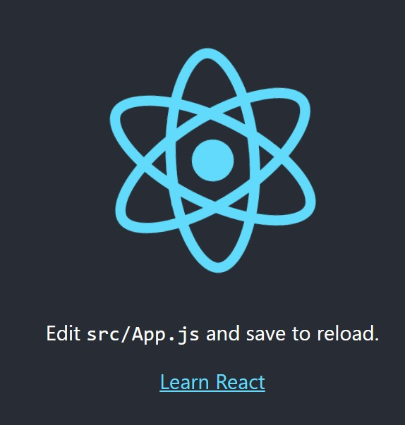

# Demo

## Erros

```CMD
'parcel' is not recognized as an internal or external command
npm install


Failed to compile.
./src/App.js
  Line 6:    'React' must be in scope when using JSX  react/react-in-jsx-scope
https://reactjs.org/blog/2022/03/08/react-18-upgrade-guide.html#updates-to-client-rendering-apis

npm install -g react-scripts
npm install react react-dom

npx react-codemod update-react-imports

```

## Basics

|Links        |Telas        |
|---          |---          |
| [006.modelo](https://renatomportugal.github.io/template/006.modelo/) | |