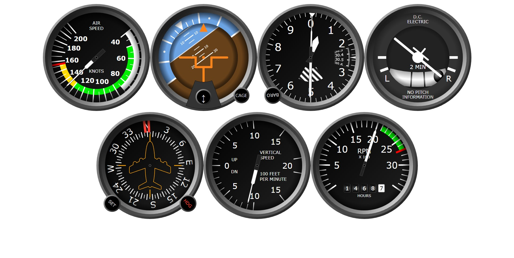
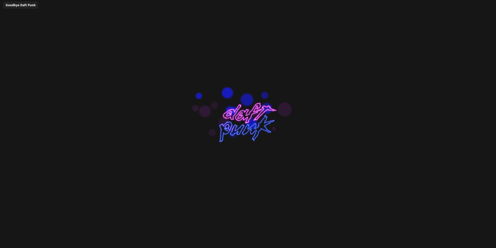
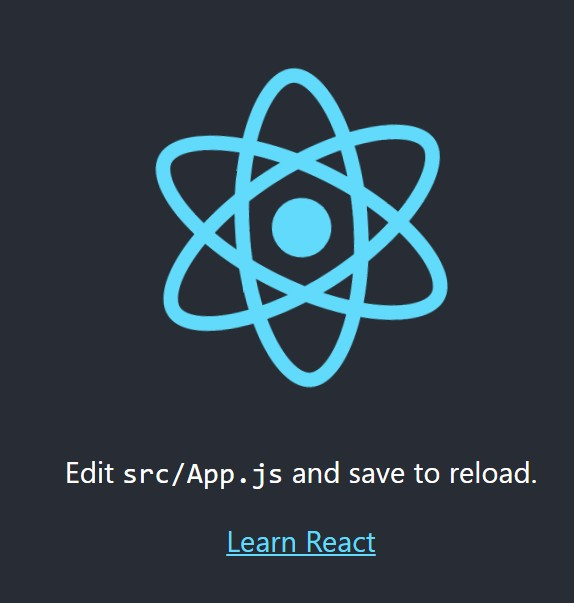

# Demo

## Erros

```CMD
'parcel' is not recognized as an internal or external command
npm install


Failed to compile.
./src/App.js
  Line 6:    'React' must be in scope when using JSX  react/react-in-jsx-scope
https://reactjs.org/blog/2022/03/08/react-18-upgrade-guide.html#updates-to-client-rendering-apis

npm install -g react-scripts
npm install react react-dom

npx react-codemod update-react-imports

```

## Basics

|Links        |Telas        |
|---          |---          |
| [001.React_Flexbox](https://github.com/renatomportugal/05.react/tree/main/001.React_Flexbox) | |
| [002.flight-instruments](https://github.com/renatomportugal/05.react/tree/main/002.flight-instruments/) | |
| [003.scroll-snap-spacer](https://github.com/renatomportugal/05.react/tree/main/003.scroll-snap-spacer/) | |
| [004.daftPunk](https://github.com/renatomportugal/05.react/tree/main/004.daftPunk/) | |
| [005.modelo](https://github.com/renatomportugal/05.react/tree/main/005.modelo/) | |