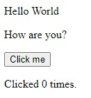
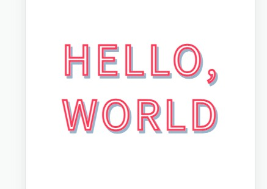
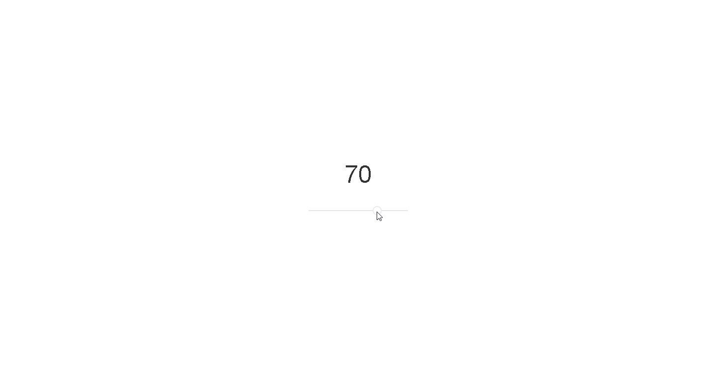
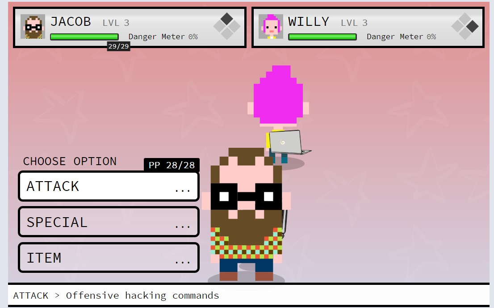

# Demo

## Erros

```CMD
[Rodar]
npm install
npm start

[Erros]
'parcel' is not recognized as an internal or external command

Failed to compile.
./src/App.js
  Line 6:    'React' must be in scope when using JSX  react/react-in-jsx-scope
https://reactjs.org/blog/2022/03/08/react-18-upgrade-guide.html#updates-to-client-rendering-apis

npm install -g react-scripts
npm install react react-dom

npx react-codemod update-react-imports

```

## Animação

|Links        |Telas        |
|---          |---          |
| [006.cdn.lil-octo-hold-finger-down-to-burst](https://github.com/renatomportugal/05.react/tree/main/006.cdn.lil-octo-hold-finger-down-to-burst/) | |
| [016.cdn.color-roulette-react](https://github.com/renatomportugal/05.react/tree/main/016.cdn.color-roulette-react/) | |
| [021.cdn.react-anime-example](https://github.com/renatomportugal/05.react/tree/main/021.cdn.react-anime-example/) | |
| [028.cdn.react-tween](https://github.com/renatomportugal/05.react/tree/main/028.cdn.react-tween/) | |
|Categoria    |Path         |
| [025.cdn.trying-out-react-motion](https://github.com/renatomportugal/05.react/tree/main/025.cdn.trying-out-react-motion/) | |

## Basics

|Basic        |Hello World        |
|---          |---          |
| [014.cdn.codepen_Pvwbgx](https://github.com/renatomportugal/05.react/tree/main/014.cdn.codepen_Pvwbgx) | |
| [005.modelo](https://github.com/renatomportugal/05.react/tree/main/005.modelo/) | |
| [015.cdn.codepen_PwRggP](https://github.com/renatomportugal/05.react/tree/main/015.cdn.codepen_PwRggP/) | |
| [022.cdn.react-basics-using-react-element-only](https://github.com/renatomportugal/05.react/tree/main/022.cdn.react-basics-using-react-element-only/) | |
| [029.cdn.react-template](https://github.com/renatomportugal/05.react/tree/main/029.cdn.react-template/) | |
| [030.cdn.react-stateless-component-hello-world-example](https://github.com/renatomportugal/05.react/tree/main/030.cdn.react-stateless-component-hello-world-example/) | |

## Catalogo

|Links        |Telas        |
|---          |---          |
| [003.scroll-snap-spacer](https://github.com/renatomportugal/05.react/tree/main/003.scroll-snap-spacer/) | |

## Contador

|Links        |Telas        |
|---          |---          |
| [044.cdn.react-contator-automatico](https://github.com/renatomportugal/05.react/tree/main/044.cdn.react-contator-automatico/) | |

## CSS

|Figuras      |Telas        |
|---          |---          |
| [049.cdn.react-carousel](https://github.com/renatomportugal/05.react/tree/main/049.cdn.react-carousel/) | |

## Date

|Links        |Telas        |
|---          |---          |
| [041.cdn.react-abstractionjsx](https://github.com/renatomportugal/05.react/tree/main/041.cdn.react-abstractionjsx/) | |

## DragDrop

|Links        |Telas        |
|---          |---          |
| [007.cdn.react-draggable-list](https://github.com/renatomportugal/05.react/tree/main/007.cdn.react-draggable-list) | |

## Eletricidade

### Bobina_de_Tesla

|Links        |Telas        |
|---          |---          |
| [010.cdn.interactive-tesla-coil-mousedown-touchmove-codepenchallenge](https://github.com/renatomportugal/05.react/tree/main/010.cdn.interactive-tesla-coil-mousedown-touchmove-codepenchallenge) | |

## E-Commerce

### Cart

|Links        |Telas        |
|---          |---          |
| [009.cdn.bazar-react-shopping-cart](https://github.com/renatomportugal/05.react/tree/main/009.cdn.bazar-react-shopping-cart) | |

## FlexBox

|Links        |Telas        |
|---          |---          |
| [001.React_Flexbox](https://github.com/renatomportugal/05.react/tree/main/001.React_Flexbox) | |
| [026.cdn.react-w-skeleton-template](https://github.com/renatomportugal/05.react/tree/main/026.cdn.react-w-skeleton-template) | |

## Formularios

|Links        |Telas        |
|---          |---          |
| [017.cdn.contact-form](https://github.com/renatomportugal/05.react/tree/main/017.cdn.contact-form/) | |
| [032.cdn.react-signup-form-example](https://github.com/renatomportugal/05.react/tree/main/032.cdn.react-signup-form-example/) | |
| [043.cdn.react-form-with-constraints-basic-example](https://github.com/renatomportugal/05.react/tree/main/043.cdn.react-form-with-constraints-basic-example/) | |

## Gráficos

|Links        |Telas        |
|---          |---          |
| [012.cdn.real-time-line-chart](https://github.com/renatomportugal/05.react/tree/main/012.cdn.real-time-line-chart) | |
| [013.cdn.svg-path-builder](https://github.com/renatomportugal/05.react/tree/main/013.cdn.svg-path-builder) | |
| [023.cdn.react-canvas-pie-chart](https://github.com/renatomportugal/05.react/tree/main/023.cdn.react-canvas-pie-chart) | |
| [024.cdn.react-d3-graph](https://github.com/renatomportugal/05.react/tree/main/024.cdn.react-d3-graph) | |
| [027.cdn.react-vis-simple-chart](https://github.com/renatomportugal/05.react/tree/main/027.cdn.react-vis-simple-chart) | |

## IHM_Interface_Homem_Maquina

|Links        |Telas        |
|---          |---          |
| [002.flight-instruments](https://github.com/renatomportugal/05.react/tree/main/002.flight-instruments/) | |
|Controle     |Botões       |
| [034.cdn.reactjs-switch-button](https://github.com/renatomportugal/05.react/tree/main/034.cdn.reactjs-switch-button/) | |
|Controle     |Painel       |
| [035.cdn.react-js-fx-tickers](https://github.com/renatomportugal/05.react/tree/main/035.cdn.react-js-fx-tickers/) | |
|Controle     |Slider       |
|---          |---          |
| [008.cdn.slider](https://github.com/renatomportugal/05.react/tree/main/008.cdn.slider) | |
|Controle     |Buscar       |
|---          |---          |
| [048.cdn.Search](https://github.com/renatomportugal/05.react/tree/main/048.cdn.Search) | |

## Imagens

|Categoria    |Geral        |
|---          |---          |
| [040.cdn.recursive-tree-react-js](https://github.com/renatomportugal/05.react/tree/main/040.cdn.recursive-tree-react-js/) | |
|Categoria    |Editor       |
| [046.cdn.react-image-editing-filter](https://github.com/renatomportugal/05.react/tree/main/046.cdn.react-image-editing-filter/) | |
|Categoria    |Crop         |
| [047.cdn.react-select-and-crop-image](https://github.com/renatomportugal/05.react/tree/main/047.cdn.react-select-and-crop-image/) | |

## I-O

|Links        |Abrir Arquivo |
|---          |---           |
| [045.cdn.open-file-select-dialogue-using-react-js](https://github.com/renatomportugal/05.react/tree/main/045.cdn.open-file-select-dialogue-using-react-js/) | |

## Jogos

|Links        |Telas        |
|---          |---          |
| [011.cdn.battle-demo-the-danger-crew-rpg](https://github.com/renatomportugal/05.react/tree/main/011.cdn.battle-demo-the-danger-crew-rpg) | |

## JSON

|Links        |Telas        |
|---          |---          |
| [019.cdn.rendering-react-from-json](https://github.com/renatomportugal/05.react/tree/main/019.cdn.rendering-react-from-json) | |
| [020.cdn.load-external-data-in-react](https://github.com/renatomportugal/05.react/tree/main/020.cdn.load-external-data-in-react) | |

## Modal

|Links        |Telas        |
|---          |---          |
| [033.cdn.react-modal-animation](https://github.com/renatomportugal/05.react/tree/main/033.cdn.react-modal-animation/) | |

## Mouse

|Links        |Telas        |
|---          |---          |
| [018.cdn.hexagon-tiles-2-1-0](https://github.com/renatomportugal/05.react/tree/main/018.cdn.hexagon-tiles-2-1-0/) | |

## Musica

|Links        |Telas        |
|---          |---          |
| [051.sonorous](https://github.com/renatomportugal/05.react/tree/main/051.sonorous/) | |

## Neon

|Links        |Telas        |
|---          |---          |
| [004.daftPunk](https://github.com/renatomportugal/05.react/tree/main/004.daftPunk/) | |

## Pessoas

|Lista        |Telas        |
|---          |---          |
| [050.cdn.profile-list](https://github.com/renatomportugal/05.react/tree/main/050.cdn.profile-list/) | |

## Slides

|Links        |Telas        |
|---          |---          |
| [031.cdn.react-slideshow](https://github.com/renatomportugal/05.react/tree/main/031.cdn.react-slideshow) | |
| [042.cdn.react-slide-show](https://github.com/renatomportugal/05.react/tree/main/042.cdn.react-slide-show) | |

## Testes

|Links        |Telas        |
|---          |---          |
| [036.cdn.react-exercise-1](https://github.com/renatomportugal/05.react/tree/main/036.cdn.react-exercise-1) | |
| [037.cdn.react-exercise-2](https://github.com/renatomportugal/05.react/tree/main/037.cdn.react-exercise-2) | |
| [038.cdn.react-exercises-3](https://github.com/renatomportugal/05.react/tree/main/038.cdn.react-exercises-3) | |

## ToDo

|Links        |Telas        |
|---          |---          |
| [039.cdn.redux-todo-notification-msg-keyboard-events](https://github.com/renatomportugal/05.react/tree/main/039.cdn.redux-todo-notification-msg-keyboard-events) | |