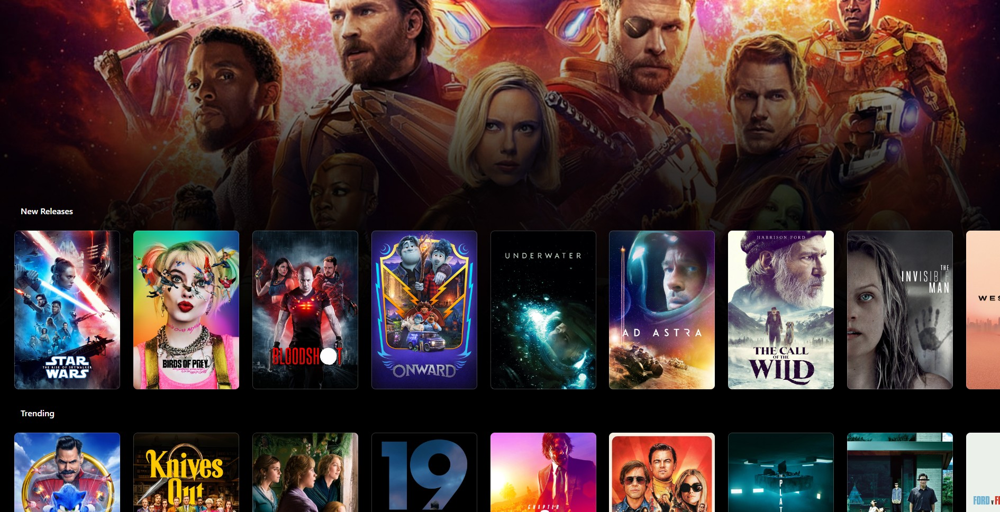

# Demo

## Erros

```CMD
[Rodar]
npm install
npm start

[Erros]
'parcel' is not recognized as an internal or external command

Failed to compile.
./src/App.js
  Line 6:    'React' must be in scope when using JSX  react/react-in-jsx-scope
https://reactjs.org/blog/2022/03/08/react-18-upgrade-guide.html#updates-to-client-rendering-apis

npm install -g react-scripts
npm install react react-dom

npx react-codemod update-react-imports

```

## Animação

|Links        |Telas        |
|---          |---          |
| [006.cdn.lil-octo-hold-finger-down-to-burst](https://github.com/renatomportugal/05.react/tree/main/006.cdn.lil-octo-hold-finger-down-to-burst/) | |
| [016.cdn.color-roulette-react](https://github.com/renatomportugal/05.react/tree/main/016.cdn.color-roulette-react/) | |
| [021.cdn.react-anime-example](https://github.com/renatomportugal/05.react/tree/main/021.cdn.react-anime-example/) | |

## Basics

|Basic        |Hello World        |
|---          |---          |
| [014.cdn.codepen_Pvwbgx](https://github.com/renatomportugal/05.react/tree/main/014.cdn.codepen_Pvwbgx) | |
| [005.modelo](https://github.com/renatomportugal/05.react/tree/main/005.modelo/) | |
| [015.cdn.codepen_PwRggP](https://github.com/renatomportugal/05.react/tree/main/015.cdn.codepen_PwRggP/) | |
| [022.cdn.react-basics-using-react-element-only](https://github.com/renatomportugal/05.react/tree/main/022.cdn.react-basics-using-react-element-only/) | |


## Catalogo

|Links        |Telas        |
|---          |---          |
| [003.scroll-snap-spacer](https://github.com/renatomportugal/05.react/tree/main/003.scroll-snap-spacer/) | |

## DragDrop

|Links        |Telas        |
|---          |---          |
| [007.cdn.react-draggable-list](https://github.com/renatomportugal/05.react/tree/main/007.cdn.react-draggable-list) | |

## Eletricidade

### Bobina_de_Tesla

|Links        |Telas        |
|---          |---          |
| [010.cdn.interactive-tesla-coil-mousedown-touchmove-codepenchallenge](https://github.com/renatomportugal/05.react/tree/main/010.cdn.interactive-tesla-coil-mousedown-touchmove-codepenchallenge) | |

## E-Commerce

### Cart

|Links        |Telas        |
|---          |---          |
| [009.cdn.bazar-react-shopping-cart](https://github.com/renatomportugal/05.react/tree/main/009.cdn.bazar-react-shopping-cart) | |

## FlexBox

|Links        |Telas        |
|---          |---          |
| [001.React_Flexbox](https://github.com/renatomportugal/05.react/tree/main/001.React_Flexbox) | |

## Formularios

|Links        |Telas        |
|---          |---          |
| [017.cdn.contact-form](https://github.com/renatomportugal/05.react/tree/main/017.cdn.contact-form/) | |

## Gráficos

|Links        |Telas        |
|---          |---          |
| [012.cdn.real-time-line-chart](https://github.com/renatomportugal/05.react/tree/main/012.cdn.real-time-line-chart) | |
| [013.cdn.svg-path-builder](https://github.com/renatomportugal/05.react/tree/main/013.cdn.svg-path-builder) | |
| [023.cdn.react-canvas-pie-chart](https://github.com/renatomportugal/05.react/tree/main/023.cdn.react-canvas-pie-chart) | |
| [024.cdn.react-d3-graph](https://github.com/renatomportugal/05.react/tree/main/024.cdn.react-d3-graph) | |

## IHM_Interface_Homem_Maquina

|Links        |Telas        |
|---          |---          |
| [002.flight-instruments](https://github.com/renatomportugal/05.react/tree/main/002.flight-instruments/) | |

## Jogos

|Links        |Telas        |
|---          |---          |
| [011.cdn.battle-demo-the-danger-crew-rpg](https://github.com/renatomportugal/05.react/tree/main/011.cdn.battle-demo-the-danger-crew-rpg) | |

## JSON

|Links        |Telas        |
|---          |---          |
| [019.cdn.rendering-react-from-json](https://github.com/renatomportugal/05.react/tree/main/019.cdn.rendering-react-from-json) | |
| [020.cdn.load-external-data-in-react](https://github.com/renatomportugal/05.react/tree/main/020.cdn.load-external-data-in-react) | |

## Mouse

|Links        |Telas        |
|---          |---          |
| [018.cdn.hexagon-tiles-2-1-0](https://github.com/renatomportugal/05.react/tree/main/018.cdn.hexagon-tiles-2-1-0/) | |

## Neon

|Links        |Telas        |
|---          |---          |
| [004.daftPunk](https://github.com/renatomportugal/05.react/tree/main/004.daftPunk/) | |

## Slider

|Links        |Telas        |
|---          |---          |
| [008.cdn.slider](https://github.com/renatomportugal/05.react/tree/main/008.cdn.slider) | |

